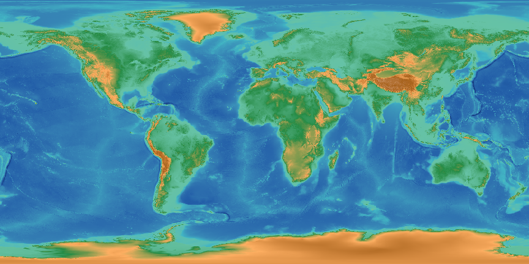

# TopoRGB
TopoRGB is a DEM in the human-readable PNG format. 

## Why TopoRGB?
TopoRGB is an alternative to TerrainRGB or Terrrarium.
- TerrainRGB & Terrarium is NOT human readable but TopoRGB is.
- TopoRGB is human readable but also readable by multimodal AIs.

***TopoRGB is a DEM readable to everyone - humans, machines, and multimodal AIs.***

## Resolution
TopoRGB theoretically has 1-m height resolution.

By default, TopoRGB PNG is decoded to GeoTIFF in integer format.

## GeoTIFF -> TopoRGB PNG + JSON
`python toporgb_codec.py *.tif`

## TopoRGB PNG (+ optionally JSON) -> GeoTIFF
`python toporgb_codec.py *.png`

## Demo
1. Download *sample_gebco_dem_1.png* and *sample_gebco_dem_1.json*.
2. Run python toporgb_codec.py *.png
3. You will get the intact GeoTIFF DEM.

## --fuzzy decoding
When --fuzzy option enabled, the color does not need to match to the palette exactly.

This allows decoding AI-generated TopoRGB and lossy format (like JPEG) TopoRGB.

## Who made this?
Fumihiko Ikegami (Ikegami GeoResearch)

## Acknowledgements
OpenAI ChatGPT o3 - I made the idea. He wrote the code.

GEBCO 2024 Grid - What the sample image is made of. Resized to 1% size.
