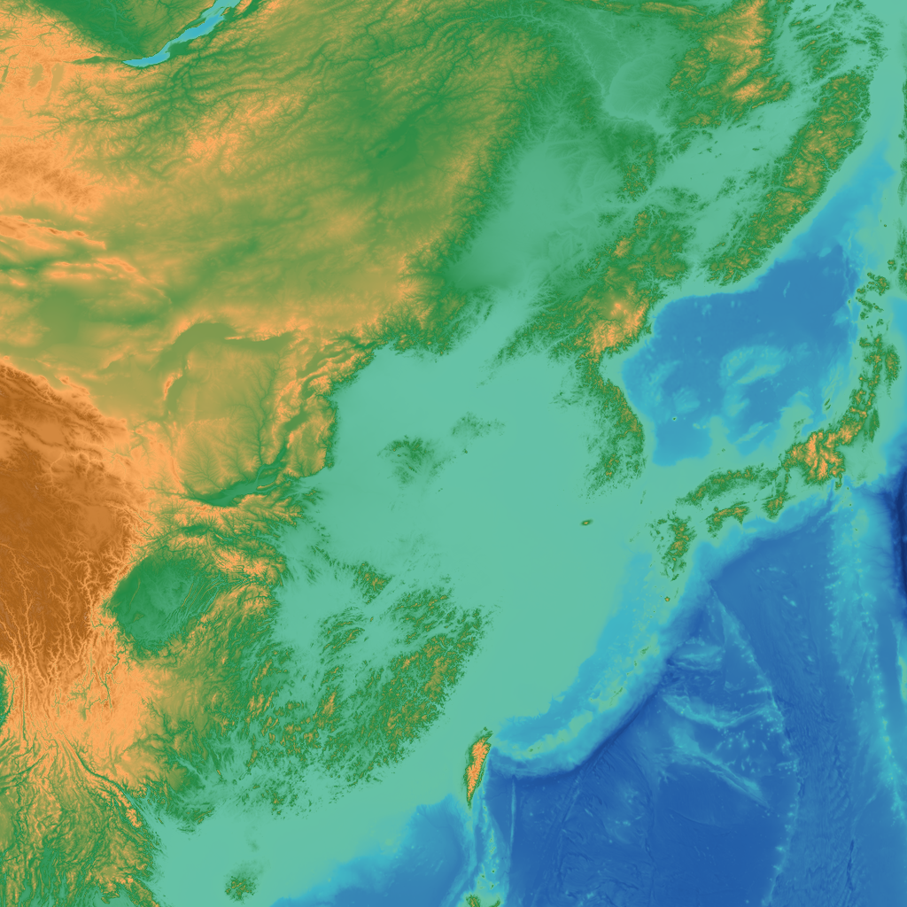

# TopoRGB
TopoRGB is a DEM in the human-readable PNG format. 

## Why TopoRGB?
TopoRGB is an alternative to TerrainRGB or Terrrarium.
- TerrainRGB & Terrarium is NOT human readable but TopoRGB is.
- TopoRGB is human readable but also readable by multimodal AIs.

TopoRGB is a DEM readable to everyone - humans, machines, and multimodal AIs.

## Resolution
TopoRGB has theoretically 1-m height resolution.

By default, TopoRGB PNG is decoded to GeoTIFF in integer format.

## Usage
Encoding: python toporgb_code.py *.tif

Decoding: python toporgb_code.py *.png

## Who made this?
Fumihiko Ikegami (Ikegami GeoResearch)

## Acknowledgements
OpenAI ChatGPT o3 - I made the idea. He wrote the code.

GEBCO 2024 Grid - What the sample image is made of.
